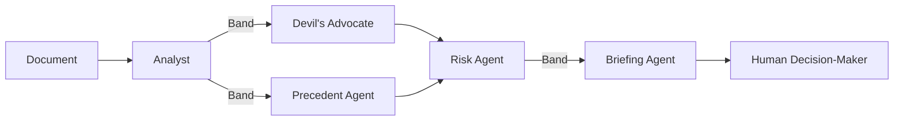

# SentinelOps — Multi-Agent Decision Intelligence

**Five AI agents. One coordinated team. 90 seconds to a complete intelligence brief.**

> Amara Diallo, VP Legal & Compliance at Meridian Ventures, has **48 hours** to sign a **$1.8M partnership contract**. Her legal team flagged nothing. The board is expecting a signature. But the contract is 74 pages — and something feels off.
>
> SentinelOps deploys five specialized agents through **Band** to review every clause, cross-reference institutional memory, stress-test the terms, and deliver an executive decision brief — in **under 90 seconds**. It finds **$2,420,000 in quantifiable exposure** across three critical and two high-severity issues.
>
> **The verdict: Do not sign as written.**
>
> Amara retains full authority. No autonomous decisions are made. The system escalates, recommends, and explains — the human decides.

---

## Live Run Evidence

See [`/evidence/`](evidence/) for full documentation of the live demonstration:

- Screenshot of the Band room with all five agents connected
- Complete live-run transcript with timestamps and provider annotations
- The GitHub Pages dashboard runs in verified demo mode, replaying outputs produced during the live run

---

## Architecture

SentinelOps is a pipeline of five agents coordinated through Band. The agents do not run sequentially — Band enables true parallel activation at the adversarial review stage.



**How it flows:**

1. **Analyst** extracts every clause, term, and financial obligation from the document
2. Analyst posts findings to **Band** — Devil's Advocate and Precedent Agent **both activate simultaneously** (parallel via Band broadcast)
3. **Devil's Advocate** attacks the contract: contradictions, unfair terms, missing protections
4. **Precedent Agent** searches institutional memory: past deals, board resolutions, vendor history
5. Both adversarial agents feed their findings to **Risk Agent**, which synthesizes a scored risk matrix with total financial exposure
6. **Briefing Agent** produces a clear executive decision brief for the human

Band is the coordination layer — not a wrapper. It broadcasts messages to all listening agents at once, enabling the true parallelism that makes the pipeline fast enough for real-time use.

---

## Partner Technology

| # | Agent | Role | Provider |
|---|-------|------|----------|
| 1 | **Analyst** | The Mapper — extracts and structures every key element | AI/ML API |
| 2 | **Devil's Advocate** | The Challenger — finds contradictions, unfair terms, missing protections | AI/ML API |
| 3 | **Precedent** | The Historian — searches company history for relevant precedents | **Featherless AI** |
| 4 | **Risk** | The Scorer — synthesizes findings into a quantified risk matrix | AI/ML API |
| 5 | **Briefing** | The Communicator — produces a clear executive decision brief | AI/ML API |

**[Band](https://band.ai)** is the agent coordination platform. All five agents connect as remote participants in a shared Band room. Band handles message routing, parallel broadcast, and presence — it is the reason these agents can function as a team rather than five isolated scripts.

**[AI/ML API](https://aimlapi.com)** provides LLM inference for four agents: Analyst, Devil's Advocate, Risk, and Briefing. These agents handle document parsing, adversarial analysis, risk scoring, and brief generation respectively.

**[Featherless AI](https://featherless.ai)** provides open-source model inference for the Precedent Agent. The Precedent Agent is configured to call Featherless AI first (`provider_order=["featherless", "aiml"]`), with AI/ML API available as a fallback. This ensures meaningful, primary usage of Featherless — not a badge.

---

## Prompt Architecture

The prompt engineering IS the product. Each agent has a deliberately crafted personality, reasoning style, and output format — not five copies of the same chatbot.

**[Read the full prompt architecture document →](SYSTEM_PROMPTS.md)**

| Agent | Voice | Reasoning Mode |
|-------|-------|----------------|
| Analyst | Neutral, clinical | Exhaustive enumeration |
| Devil's Advocate | Aggressive, skeptical | Adversarial attack |
| Precedent | Calm authority | Temporal pattern-matching |
| Risk | Measured, numeric | Quantitative synthesis |
| Briefing | Concise, action-oriented | Executive prioritization |

A single LLM call cannot simultaneously be exhaustively neutral, aggressively adversarial, and calmly authoritative. The multi-agent architecture forces each perspective to be fully developed before synthesis occurs.

---

## Scenarios

### Scenario A: Partnership Contract — Amara's Decision

**Persona:** Amara Diallo, VP Legal & Compliance, Meridian Ventures

Amara has 48 hours to sign a $1.8M partnership agreement with GlobalTech Solutions. The contract is 74 pages. SentinelOps finds:

- Board Resolution BRD-2023-47 violated by automatic IP transfer (Section 4.1)
- The same vendor was evaluated and rejected 12 months ago — reasons unchanged
- 5+ year effective lock-in buried across two sections 33 pages apart
- $500K liability cap on a $1.8M deal (27.8% coverage)
- "Best efforts" language identical to a clause that cost the company $340K

**Risk Score:** 8.5 / 10 — EXTREME  
**Total Financial Exposure:** $2,420,000  
**Verdict:** Do not sign as written. Five clauses require renegotiation minimum.

---

### Scenario B: Vendor Selection — Marcus's Decision

**Persona:** Marcus Webb, Head of Infrastructure, Meridian Ventures

Where Scenario A demonstrates SentinelOps stopping a bad decision, Scenario B demonstrates it **navigating disagreement to enable a good one**. Marcus needs to pick the safest path forward for a critical migration — not just avoid risk, but find the best option and define the conditions for safe execution.

SentinelOps evaluates all three proposals, retrieves a 2024 billing dispute with one vendor from institutional memory, and scores risk across eight dimensions. **The agents disagree**: Devil's Advocate champions Stratos Cloud for its superior SLA and fixed pricing. Risk Agent raises operational concerns (47-person company, proprietary lock-in). Briefing Agent synthesizes both positions into a conditional recommendation.

**Recommended:** Stratos Cloud (Risk Score 4.2/10 — best SLA, subject to 4 conditions)  
**Rejected:** Apex Systems (Risk Score 8.9/10 — DO NOT SELECT)  
**Fallback:** NimbusStack (Risk Score 5.1/10 — adequate but doesn't meet board reliability mandate)  
**Exposure Avoided vs. Apex:** $710,000  
**Verdict:** Select Stratos Cloud — subject to phased rollout, SLA penalty escrow, open-API addendum, and staffing/escalation clause. If conditions refused, revert to NimbusStack.

---

## Setup & Development

### Tech Stack

- **[Band](https://band.ai)** — Agent coordination platform (core)
- **[AI/ML API](https://aimlapi.com)** — LLM inference for Analyst, Devil's Advocate, Risk, Briefing
- **[Featherless AI](https://featherless.ai)** — Open-source model inference for Precedent Agent
- **Python 3.10+** — All agent scripts
- **HTML/CSS/JS** — Real-time dashboard

### Project Structure

```
sentinelops/
├── agents/
│   ├── analyst_agent.py          # Agent 1: The Mapper (AI/ML API)
│   ├── devils_advocate_agent.py  # Agent 2: The Challenger (AI/ML API)
│   ├── precedent_agent.py        # Agent 3: The Historian (Featherless AI → AI/ML API fallback)
│   ├── risk_agent.py             # Agent 4: The Scorer (AI/ML API)
│   ├── briefing_agent.py         # Agent 5: The Communicator (AI/ML API)
│   └── resilient_adapter.py      # Multi-provider adapter with configurable provider order
├── data/
│   ├── scenario_a.json           # Demo: $1.8M partnership contract
│   ├── scenario_b_vendor.json    # Demo: Cloud vendor selection
│   └── company_history.json      # Meridian Ventures institutional memory
├── dashboard/
│   └── index.html                # Real-time analysis dashboard
├── docs/
│   └── index.html                # GitHub Pages dashboard (demo mode)
├── evidence/
│   └── README.md                 # Live run evidence and screenshots
├── SYSTEM_PROMPTS.md              # Prompt architecture documentation
├── server.py                     # Live dashboard server (bridges Band → browser)
├── run_demo.py                   # Full pipeline runner
├── agent_config.yaml             # Band agent credentials (gitignored)
├── requirements.txt
└── .env.example
```

### Prerequisites

- Python 3.10+
- Band account ([band.ai](https://band.ai))
- AI/ML API key ([aimlapi.com](https://aimlapi.com))
- Featherless AI key ([featherless.ai](https://featherless.ai))

### Installation

```bash
git clone https://github.com/KaraboMolemworx/sentinelops.git
cd sentinelops

python -m venv .venv
source .venv/bin/activate

pip install -r requirements.txt

cp .env.example .env
# Edit .env with your API keys
```

### Configure Band Agents

1. Create 5 Remote Agents on [app.band.ai](https://app.band.ai)
2. Copy each agent's ID and API key into `agent_config.yaml`
3. Add all 5 agents to a shared Band room

### Run

```bash
# Full pipeline (recommended)
python run_demo.py --clean

# Or run individually in 5 terminals
python agents/analyst_agent.py
python agents/devils_advocate_agent.py
python agents/precedent_agent.py
python agents/risk_agent.py
python agents/briefing_agent.py
```

---

**Band of Agents Hackathon 2026** · Track 3: Regulated & High-Stakes Workflows · Legal contract review · Audit trail · Escalation · Human authority retained at every stage
