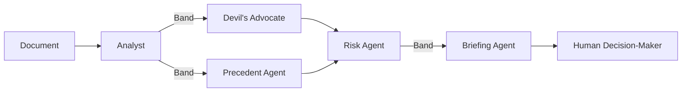

# SentinelOps - Multi-Agent Decision Intelligence

**Five AI agents. One coordinated team. Minutes, not days.**

> Amara Diallo, VP Legal & Compliance at Meridian Ventures, has **48 hours** to sign a **$1.8M partnership contract**. Her legal team flagged nothing. The board is expecting a signature. But the contract is 74 pages - and something feels off.
>
> SentinelOps deploys five specialized agents through **Band** to review every clause, cross-reference institutional memory, stress-test the terms, and deliver an executive decision brief - in **minutes, not days**. It finds **$2,420,000 in quantifiable exposure** across three critical and two high-severity issues.
>
> **The verdict: Do not sign as written.**
>
> Amara retains full authority. No autonomous decisions are made. The system escalates, recommends, and explains - the human decides.

---

## Live Run Evidence

See [`/evidence/`](evidence/) for full documentation of the live demonstration:

- Screenshot of the Band room with all five agents connected
- Complete live-run transcript with timestamps and provider annotations
- The GitHub Pages dashboard runs in verified demo mode, replaying outputs produced during the live run

---

## Architecture

SentinelOps is a pipeline of five agents coordinated through Band. The agents do not run sequentially - Band enables true parallel activation at the adversarial review stage.



**How it flows:**

1. **Analyst** extracts every clause, term, and financial obligation from the document
2. Analyst posts findings to **Band** - Devil's Advocate and Precedent Agent **both activate simultaneously** (parallel via Band broadcast)
3. **Devil's Advocate** attacks the contract: contradictions, unfair terms, missing protections
4. **Precedent Agent** searches institutional memory: past deals, board resolutions, vendor history
5. Both adversarial agents feed their findings to **Risk Agent**, which synthesizes a scored risk matrix with total financial exposure
6. **Briefing Agent** produces a clear executive decision brief for the human

Band is the coordination layer - not a wrapper. It broadcasts messages to all listening agents at once, enabling the true parallelism that makes the pipeline fast enough for real-time use.

---

## Why Band - Not a Wrapper

Band is not an integration of convenience. It provides three architectural capabilities that SentinelOps depends on:

1. **True parallel broadcast.** When Analyst posts findings to the Band room, Devil's Advocate and Precedent Agent both receive the message simultaneously. Without Band, Analyst would have to call each downstream agent sequentially - doubling the runtime of the adversarial review stage. Band's broadcast model is what makes fork/merge parallelism possible.

2. **Shared room context.** Risk Agent waits for both parallel agents to complete before activating. Band's room model provides natural synchronization - Risk Agent listens in the same room and can see when both DA and Precedent have posted. No custom orchestration logic needed; the coordination emerges from the messaging topology.

3. **Observable coordination.** Every message routed through Band is visible in the Band Coordination Log on the dashboard. Judges, auditors, and enterprise buyers can see exactly which agent said what, when, and to whom. This is not possible with direct function calls between agents - Band makes the coordination layer transparent and auditable.

Remove Band and SentinelOps becomes five isolated scripts with a for-loop. Band is what makes them a team.

---

## Cross-Framework Architecture

SentinelOps demonstrates that Band can coordinate agents built with **three different LLM integration frameworks** - all communicating through the same Band room:

| # | Agent | Role | Framework | Provider |
|---|-------|------|-----------|----------|
| 1 | **Analyst** | The Mapper | **httpx** (ResilientAdapter) | AI/ML API |
| 2 | **Devil's Advocate** | The Challenger | **LangChain** (ChatPromptTemplate \| ChatOpenAI \| StrOutputParser) | AI/ML API → Featherless AI |
| 3 | **Precedent** | The Historian | **OpenAI SDK** (AsyncOpenAI) | Featherless AI → AI/ML API |
| 4 | **Risk** | The Scorer | **httpx** (ResilientAdapter) | AI/ML API |
| 5 | **Briefing** | The Communicator | **httpx** (ResilientAdapter) | AI/ML API |

**Three integration patterns, one coordination layer:**

1. **Native httpx** (`resilient_adapter.py`) - Analyst, Risk, and Briefing agents use raw async HTTP calls with multi-provider fallback. This is the simplest pattern: direct API calls with structured error handling.

2. **LangChain** (`langchain_adapter.py`) - Devil's Advocate uses a full LangChain chain: `ChatPromptTemplate | ChatOpenAI | StrOutputParser`. The chain is built at init and invoked with `.ainvoke()`. This demonstrates that an agent built with LangChain's composable chain pattern can participate in Band coordination alongside agents using completely different approaches.

3. **OpenAI Python SDK** (`openai_adapter.py`) - Precedent Agent uses `openai.AsyncOpenAI` clients pointed at OpenAI-compatible endpoints. The SDK handles streaming, retries, and type safety. This is a third distinct integration pattern coordinating through the same Band room.

**The point:** Band doesn't care how each agent calls its LLM. It coordinates messages between agents regardless of their internal implementation. A team can mix frameworks without rewriting existing agent code.

---

## Partner Technology

**[Band](https://band.ai)** is the agent coordination platform. All five agents connect as remote participants in a shared Band room. Band handles message routing, parallel broadcast, and presence - it is the reason these agents can function as a team rather than five isolated scripts.

**[AI/ML API](https://aimlapi.com)** provides LLM inference for four agents: Analyst, Devil's Advocate, Risk, and Briefing. These agents handle document parsing, adversarial analysis, risk scoring, and brief generation respectively.

**[Featherless AI](https://featherless.ai)** provides open-source model inference for the Precedent Agent. The Precedent Agent is configured with Featherless AI as its **primary provider**, not a fallback. This is a deliberate architectural choice: institutional memory retrieval benefits from open-source model flexibility (Qwen3-30B-A3B via Featherless), and Featherless's serverless inference means no cold-start latency for this critical-path agent. AI/ML API is available only as a secondary fallback.

---

## Prompt Architecture

The prompt engineering IS the product. Each agent has a deliberately crafted personality, reasoning style, and output format - not five copies of the same chatbot.

**[Read the full prompt architecture document →](SYSTEM_PROMPTS.md)**

| Agent | Voice | Reasoning Mode |
|-------|-------|----------------|
| Analyst | Neutral, clinical | Exhaustive enumeration |
| Devil's Advocate | Aggressive, skeptical | Adversarial attack |
| Precedent | Calm authority | Temporal pattern-matching |
| Risk | Measured, numeric | Quantitative synthesis |
| Briefing | Concise, action-oriented | Executive prioritization |

A single LLM call cannot simultaneously be exhaustively neutral, aggressively adversarial, and calmly authoritative. The multi-agent architecture forces each perspective to be fully developed before synthesis occurs.

---

## Scenarios

### Scenario A: Partnership Contract - Amara's Decision

**Persona:** Amara Diallo, VP Legal & Compliance, Meridian Ventures

Amara has 48 hours to sign a $1.8M partnership agreement with GlobalTech Solutions. The contract is 74 pages. SentinelOps finds:

- Board Resolution BRD-2023-47 violated by automatic IP transfer (Section 4.1)
- The same vendor was evaluated and rejected 12 months ago - reasons unchanged
- 5+ year effective lock-in buried across two sections 33 pages apart
- $500K liability cap on a $1.8M deal (27.8% coverage)
- "Best efforts" language identical to a clause that cost the company $340K

**Risk Score:** 8.5 / 10 - EXTREME  
**Total Financial Exposure:** $2,420,000  
**Verdict:** Do not sign as written. Five clauses require renegotiation minimum.

---

### Scenario B: Vendor Selection - Marcus's Decision

**Persona:** Marcus Webb, Head of Infrastructure, Meridian Ventures

Where Scenario A demonstrates SentinelOps stopping a bad decision, Scenario B demonstrates it **navigating disagreement to enable a good one**. Marcus needs to pick the safest path forward for a critical migration - not just avoid risk, but find the best option and define the conditions for safe execution.

SentinelOps evaluates all three proposals, retrieves a 2024 billing dispute with one vendor from institutional memory, and scores risk across eight dimensions. **The agents disagree**: Devil's Advocate champions Stratos Cloud for its superior SLA and fixed pricing. Risk Agent raises operational concerns (47-person company, proprietary lock-in). Briefing Agent synthesizes both positions into a conditional recommendation.

**Recommended:** Stratos Cloud (Risk Score 4.2/10 - best SLA, subject to 4 conditions)  
**Rejected:** Apex Systems (Risk Score 8.9/10 - DO NOT SELECT)  
**Fallback:** NimbusStack (Risk Score 5.1/10 - adequate but doesn't meet board reliability mandate)  
**Exposure Avoided vs. Apex:** $710,000  
**Verdict:** Select Stratos Cloud - subject to phased rollout, SLA penalty escrow, open-API addendum, and staffing/escalation clause. If conditions refused, revert to NimbusStack.

---

## Human-in-the-Loop

After the automated pipeline completes, SentinelOps doesn't end the conversation - it opens one. The **Briefing Agent** switches to follow-up mode, allowing the human decision-maker to ask questions about the analysis:

- "What about Section 4.1?" → Briefing Agent explains the IP transfer risk with specific citations
- "Compare the liability caps" → Structured comparison with dollar amounts and benchmarks
- "What would you negotiate first?" → Prioritized action items from the analysis

The follow-up chat appears in the dashboard after all five agents have reported. Questions are routed to the Briefing Agent through Band, which responds using the full conversation history - all agent findings, precedents, and risk scores are available as context.

This is not a separate chatbot. It is the same Briefing Agent, in the same Band room, with access to everything the other four agents said. The human retains authority - the system answers questions, not makes decisions.

---

## Dynamic Scenario Loading

Scenario data is loaded from JSON files in `/data/` at runtime - not hardcoded in agent source files:

- `data/scenario_a.json` - Partnership contract clauses and terms
- `data/scenario_b_vendor.json` - Vendor proposals with pricing, SLAs, exit terms
- `data/company_history.json` - Institutional memory (11 entries across both scenarios)

The `scenario_loader.py` module detects which scenario is being requested from the incoming message text (keyword matching for "vendor", "cloud", "migration" → Scenario B, else A), loads the corresponding JSON, and formats it into the system prompt template. Adding a new scenario means adding a JSON file - no agent code changes required.

---

## Setup & Development

### Tech Stack

- **[Band](https://band.ai)** - Agent coordination platform (core)
- **[AI/ML API](https://aimlapi.com)** - LLM inference for Analyst, Devil's Advocate, Risk, Briefing
- **[Featherless AI](https://featherless.ai)** - Open-source model inference for Precedent Agent
- **[LangChain](https://python.langchain.com)** - Chain-based LLM integration (Devil's Advocate)
- **[OpenAI SDK](https://github.com/openai/openai-python)** - SDK-based LLM integration (Precedent Agent)
- **Python 3.10+** - All agent scripts
- **HTML/CSS/JS** - Real-time dashboard with human-in-the-loop follow-up

### Project Structure

```
sentinelops/
├── agents/
│   ├── analyst_agent.py          # Agent 1: The Mapper (httpx / ResilientAdapter)
│   ├── devils_advocate_agent.py  # Agent 2: The Challenger (LangChain)
│   ├── precedent_agent.py        # Agent 3: The Historian (OpenAI SDK)
│   ├── risk_agent.py             # Agent 4: The Scorer (httpx / ResilientAdapter)
│   ├── briefing_agent.py         # Agent 5: The Communicator (httpx / ResilientAdapter)
│   ├── resilient_adapter.py      # Native httpx adapter with multi-provider fallback
│   ├── langchain_adapter.py      # LangChain chain adapter (ChatPromptTemplate | ChatOpenAI | StrOutputParser)
│   ├── openai_adapter.py         # OpenAI SDK adapter (AsyncOpenAI)
│   └── scenario_loader.py        # Dynamic scenario data loading from JSON
├── data/
│   ├── scenario_a.json           # Scenario A: $1.8M partnership contract
│   ├── scenario_b_vendor.json    # Scenario B: Cloud vendor selection (3 vendors)
│   └── company_history.json      # Meridian Ventures institutional memory (11 entries)
├── dashboard/
│   └── index.html                # Real-time dashboard with human-in-the-loop chat
├── docs/
│   └── index.html                # GitHub Pages dashboard (demo mode)
├── evidence/
│   └── README.md                 # Live run evidence and screenshots
├── SYSTEM_PROMPTS.md              # Prompt architecture documentation
├── server.py                     # Dashboard server + follow-up endpoint
├── run_demo.py                   # Full pipeline runner
├── agent_config.yaml             # Band agent credentials (gitignored)
├── requirements.txt
└── .env.example
```

### Prerequisites

- Python 3.10+
- Band account ([band.ai](https://band.ai))
- AI/ML API key ([aimlapi.com](https://aimlapi.com))
- Featherless AI key ([featherless.ai](https://featherless.ai))

### Installation

```bash
git clone https://github.com/KaraboMolemworx/sentinelops.git
cd sentinelops

python -m venv .venv
source .venv/bin/activate

pip install -r requirements.txt

cp .env.example .env
# Edit .env with your API keys
```

### Configure Band Agents

1. Create 5 Remote Agents on [app.band.ai](https://app.band.ai)
2. Copy each agent's ID and API key into `agent_config.yaml`
3. Add all 5 agents to a shared Band room

### Run

```bash
# Full pipeline (recommended)
python run_demo.py --clean

# Or run individually in 5 terminals
python agents/analyst_agent.py
python agents/devils_advocate_agent.py
python agents/precedent_agent.py
python agents/risk_agent.py
python agents/briefing_agent.py
```

---

**Band of Agents Hackathon 2026** · Track 3: Regulated & High-Stakes Workflows · Legal contract review · Audit trail · Escalation · Human authority retained at every stage
