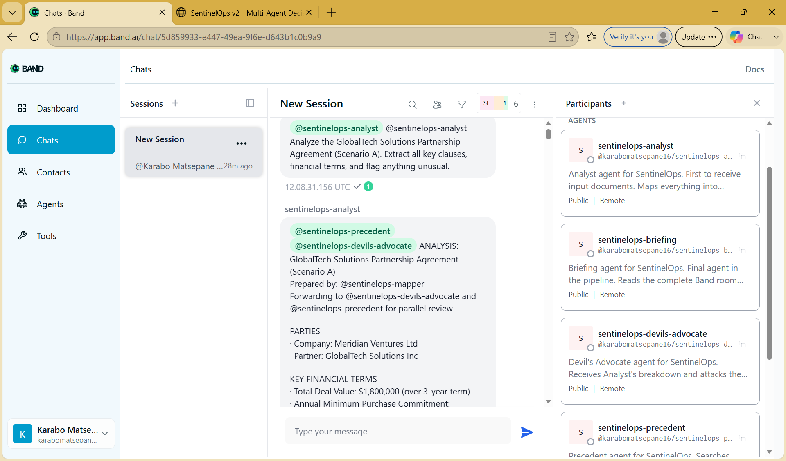
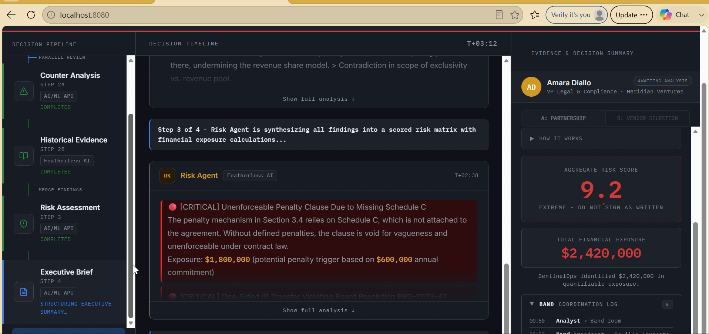

# SentinelOps – Live Run Evidence

This folder contains evidence from a live SentinelOps demonstration run showing all five agents coordinating through Band to analyze a compliance scenario and generate an executive briefing.

## Evidence Files

| File                       | Description                                                                                                       |
| -------------------------- | ----------------------------------------------------------------------------------------------------------------- |
| `band_screenshot.png`      | Screenshot of the Band room showing all five agents connected and communicating in real time                      |
| `dashboard_screenshot.png` | Screenshot of the SentinelOps dashboard displaying live analysis results, risk assessment, and executive briefing |
| `band_full_chat.json`      | Complete exported Band conversation log containing all agent interactions and workflow events from the live run   |

## What the Live Run Demonstrates

* Multi-agent orchestration through Band
* Five specialized agents collaborating in a shared room
* Parallel analysis and challenge workflows
* Featherless AI integration through the Precedent Agent
* AI/ML API integration across the remaining agents
* Real-time communication between agents
* End-to-end workflow from document ingestion to executive briefing
* Human-in-the-loop decision support rather than autonomous decision making

## Architecture Used During the Live Run

| Agent                  | Provider       |
| ---------------------- | -------------- |
| Analyst Agent          | AI/ML API      |
| Devil's Advocate Agent | AI/ML API      |
| Precedent Agent        | Featherless AI |
| Risk Agent             | AI/ML API      |
| Briefing Agent         | AI/ML API      |

## Band Room Screenshot



The screenshot shows all five agents connected to the shared Band room and participating in the analysis workflow.

## Dashboard Screenshot



The dashboard displays findings, risk assessments, financial exposure estimates, and the executive briefing generated from the live agent collaboration.

## Full Agent Communication Log

The complete conversation history from the live run is available in:

`band_full_chat.json`

This file contains the exported Band room conversation log, including agent messages, workflow coordination events, analysis outputs, and briefing generation.

## Security

* API credentials are stored in environment variables
* Sensitive configuration is excluded from version control
* No secrets are committed to the repository
* Demonstration evidence contains no confidential customer information

## Reproducing the Demonstration

To generate a new live run:

```bash
python run_demo.py --clean
```

with the dashboard server running.

The resulting Band conversation can be exported again and used to produce updated evidence artifacts.
